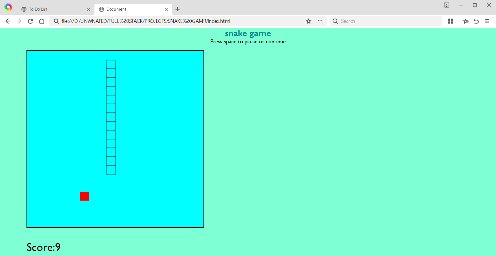

# 🐍 Simple Snake Game

A fun and classic **Snake Game** built using **HTML**, **CSS**, and **JavaScript**. This project demonstrates core game development concepts like real-time movement, collision detection, score tracking, and dynamic UI updates using vanilla JavaScript.

## 🎮 Features

- 🐍 Smooth snake movement with arrow keys
- 🍎 Random food spawning
- 📈 Score tracking as the snake eats food
- 💥 Game Over detection when snake hits the wall or itself
- 🔁 Restart functionality

## 🚀 Live Demo

> [Add your GitHub Pages or Netlify link here]  
> Example: https://sivabalan-cmd.github.io/Simple-Snake-Game/

## 📸 Screenshot

> *(Optional: Add a screenshot of the game UI)*  
> 

## 🛠️ Built With

- **HTML** – Structure  
- **CSS** – Styling  
- **JavaScript** – Game logic and interaction  

## 📂 Getting Started

To run the game locally:

1. **Clone the repository:**

```bash
git clone https://github.com/yourusername/snake-game.git
Navigate to the project folder:

bash
Copy code
cd snake-game
Open the game in your browser:

Double-click index.html or run it with a live server extension in VS Code.

📄 License
This project is licensed under the MIT License.

🙌 Acknowledgements
Classic Snake Game logic

Built for learning and fun 🚀
